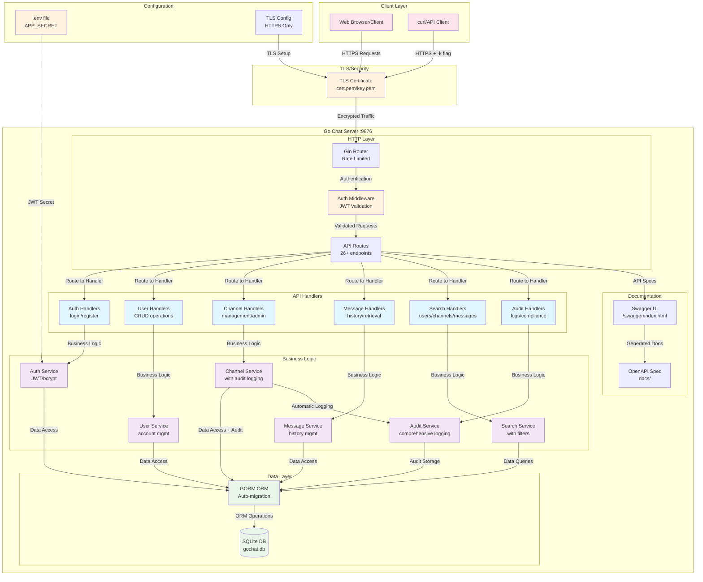
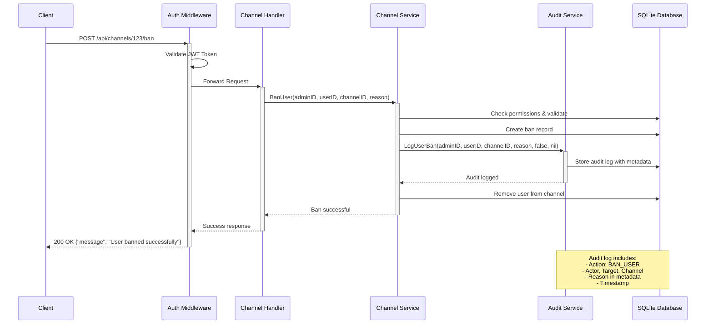
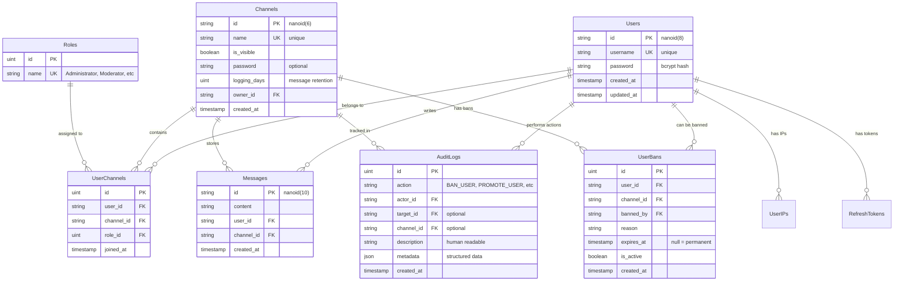
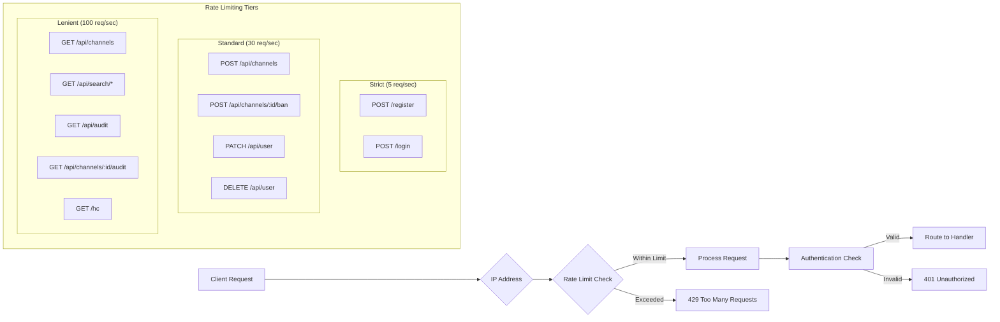

# Go Chat Server

A modern, secure chat server built with Go, featuring JWT authentication, comprehensive channel management, and full audit logging capabilities.

## Features

- **🔐 Secure Authentication**: JWT-based authentication with refresh tokens and bcrypt password hashing
- **👥 User Management**: Complete user lifecycle with account updates and deletion
- **💬 Channel System**: Create, join, and manage channels with password protection and visibility controls
- **🛡️ Admin Controls**: User banning, role management, and channel administration
- **🔍 Search Functionality**: Search users, channels, and message history with filtering
- **📋 Audit Logging**: Comprehensive audit trails for all admin actions with metadata
- **💾 Message History**: Configurable message logging and retrieval system
- **⚡ Rate Limiting**: Tiered IP-based rate limiting to protect against abuse
- **📚 API Documentation**: Complete Swagger/OpenAPI documentation with interactive UI
- **🔒 TLS Security**: HTTPS-only server with certificate-based encryption
- **💾 SQLite Database**: Lightweight database with GORM ORM and auto-migrations
- **🧪 Test Coverage**: Test-driven development with comprehensive test suites

## Quick Start

### Prerequisites

- Go 1.21 or later
- Make (optional, for convenience commands)
- OpenSSL (for certificate generation)

### Installation

1. **Clone the repository:**
   ```bash
   git clone <repository-url>
   cd go-chat
   ```

2. **Install dependencies:**
   ```bash
   go mod download
   ```

3. **Generate required certificates and secrets:**
   ```bash
   make generate-cert    # Creates cert.pem and key.pem
   make generate-secret  # Creates .env with APP_SECRET
   ```

4. **Run the server:**
   ```bash
   go run ./cmd/server
   ```

The server will start on `https://localhost:9876`

### Troubleshooting

**TLS Certificate Warnings:**
When accessing `https://localhost:9876`, your browser will show a security warning because we're using a self-signed certificate. This is normal for development:

- **Chrome/Edge**: Click "Advanced" → "Proceed to localhost (unsafe)"
- **Firefox**: Click "Advanced" → "Accept the Risk and Continue" 
- **Safari**: Click "Show Details" → "visit this website"

**Alternative: Use curl to test:**
```bash
# Health check
curl -k https://localhost:9876/hc

# API Documentation (JSON)
curl -k https://localhost:9876/swagger/doc.json
```

**Port Already in Use:**
```bash
# Find process using port 9876
ss -tulpn | grep :9876

# Kill the process (replace PID with actual process ID)
kill -9 <PID>
```

## API Documentation

Once the server is running, visit `https://localhost:9876/swagger/index.html` for interactive API documentation.

### Key Endpoints

#### Authentication
- `POST /register` - Register a new user
- `POST /login` - User login
- `POST /api/logout` - Logout (requires auth)
- `POST /api/refresh_token` - Refresh JWT token

#### User Management
- `PATCH /api/user` - Update username/password
- `DELETE /api/user` - Delete account
- `GET /api/user/channels/owned` - List owned channels
- `GET /api/user/channels/joined` - List joined channels

#### Channels
- `GET /api/channels` - List all visible channels
- `POST /api/channels` - Create a new channel
- `GET /api/channels/:id` - Get channel details
- `GET /api/channels/:id/users` - List channel members
- `POST /api/channels/:id/join` - Join a channel
- `DELETE /api/channels/:id/leave` - Leave a channel
- `DELETE /api/channels/:id` - Delete channel (owner only)

#### Channel Administration
- `POST /api/channels/:id/ban` - Permanently ban a user
- `POST /api/channels/:id/tempban` - Temporarily ban a user
- `DELETE /api/channels/:id/ban/:userId` - Unban a user
- `GET /api/channels/:id/bans` - List channel bans
- `POST /api/channels/:id/promote` - Promote user role
- `POST /api/channels/:id/demote` - Demote user role

#### Message History
- `GET /api/channels/:id/messages` - Get channel message history

#### Search
- `GET /api/search/users` - Search users by username
- `GET /api/search/channels` - Search visible channels by name
- `GET /api/search/messages` - Search messages within a channel

#### Audit Logs
- `GET /api/channels/:id/audit` - Channel audit logs (owner only)
- `GET /api/audit` - System audit logs with filtering

## Rate Limiting

The server implements tiered rate limiting:

- **Authentication endpoints**: 5 req/sec (burst: 10) - Strict protection against brute force
- **General API endpoints**: 30 req/sec (burst: 50) - Standard protection
- **Read-only endpoints**: 100 req/sec (burst: 200) - Lenient for browsing

## Development

### Build Commands

```bash
make build-linux      # Build for Linux (amd64)
make build-macos      # Build for macOS (arm64) 
make build-windows    # Build for Windows (amd64)
make clear            # Clean build artifacts
```

### Testing

```bash
make test             # Run all tests
make test-verbose     # Run with verbose output
make test-coverage    # Generate coverage report
```

**Run specific test suites:**
```bash
go test ./internal/api/...       # Test API layer
go test ./internal/audit/...     # Test audit system
go test ./internal/auth/...      # Test authentication
go test -v ./internal/search/... # Test search with verbose output
```

### Documentation

```bash
make docs             # Generate Swagger documentation
```

### Database

The server uses SQLite with automatic migrations. The database file `gochat.db` is created automatically on first run.

**Default roles seeded:**
- Administrator - Full system access
- Moderator - Channel moderation capabilities
- Member - Standard user privileges  
- Guest - Limited read-only access

## Architecture

### Project Structure

```
cmd/server/          # Application entry point
internal/
  api/               # HTTP handlers and routing
  audit/             # Audit logging system
  auth/              # Authentication middleware and logic
  channel/           # Channel business logic
  message/           # Message management
  middleware/        # HTTP middleware (rate limiting, etc.)
  search/            # Search functionality
  storage/           # Database configuration
  user/              # User management business logic
  utils/             # Shared utilities
  version/           # Version information
pkg/chat/            # Shared data models
docs/                # Generated API documentation
```

### Technology Stack

- **Framework**: Gin (HTTP), Gorilla WebSocket
- **Database**: SQLite with GORM ORM
- **Authentication**: JWT with golang-jwt/jwt/v5
- **Security**: bcrypt, TLS/HTTPS, rate limiting
- **Documentation**: Swagger/OpenAPI with swaggo/swag
- **ID Generation**: Custom nanoid implementation
- **Testing**: testify/assert for comprehensive test suites

## Configuration

### Environment Variables

Create a `.env` file (or use `make generate-secret`):

```env
APP_SECRET=your-jwt-signing-secret-here
```

### TLS Certificates

Generate certificates (or use `make generate-cert`):

```bash
openssl req -x509 -newkey rsa:4096 -keyout key.pem -out cert.pem -days 365 -nodes
```

**Example certificate generation:**
```bash
# When prompted, you can use these example values:
# Country Name: US
# State: California  
# City: San Francisco
# Organization: Dev
# Organizational Unit: IT
# Common Name: localhost
# Email: dev@localhost
```

## Usage Examples

### Register and Login
```bash
# Register a new user
curl -k -X POST https://localhost:9876/register \
  -H "Content-Type: application/json" \
  -d '{"username": "alice", "password": "securepass123"}'

# Login
curl -k -X POST https://localhost:9876/login \
  -H "Content-Type: application/json" \
  -d '{"username": "alice", "password": "securepass123"}'
```

### Create and Join Channels
```bash
# Create a channel (requires auth cookie from login)
curl -k -X POST https://localhost:9876/api/channels \
  -H "Content-Type: application/json" \
  -b "cookies.txt" \
  -d '{"name": "general", "is_visible": true}'

# Join a channel
curl -k -X POST https://localhost:9876/api/channels/{channel-id}/join \
  -H "Content-Type: application/json" \
  -b "cookies.txt" \
  -d '{}'
```

## Security Features

- **JWT Authentication**: Secure token-based authentication with refresh tokens
- **Password Hashing**: bcrypt with salt for secure password storage
- **Rate Limiting**: Protection against brute force and spam attacks
- **TLS Encryption**: All traffic encrypted with HTTPS
- **Input Validation**: Comprehensive request validation and sanitization
- **Audit Logging**: Complete audit trail of all admin actions
- **Access Controls**: Role-based permissions for channel management

## Contributing

Please read [CONTRIBUTING.md](CONTRIBUTING.md) for details on our code of conduct and development process.

## Health Check

The server provides a health check endpoint at `GET /hc` that returns "Running" when the server is operational.

```bash
curl -k https://localhost:9876/hc
# Response: Running
```

## Architecture Diagram

### System Overview



### Data Flow for Admin Actions



### Database Schema Overview



### Rate Limiting Strategy



## License

This project is licensed under the GNU Affero General Public License v3.0 - see the LICENSE file for details.